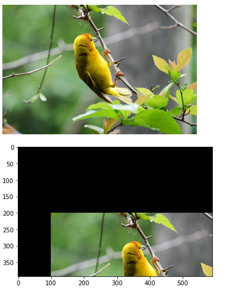
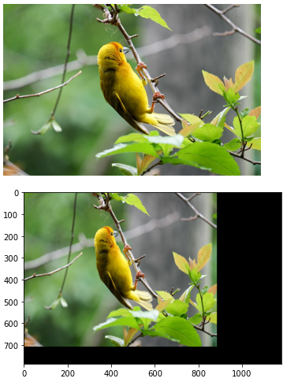
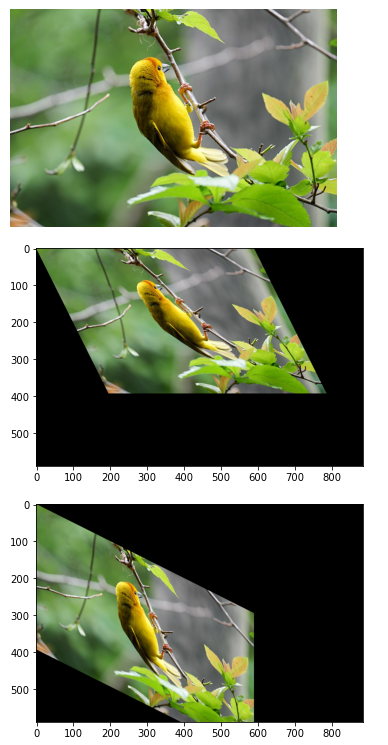
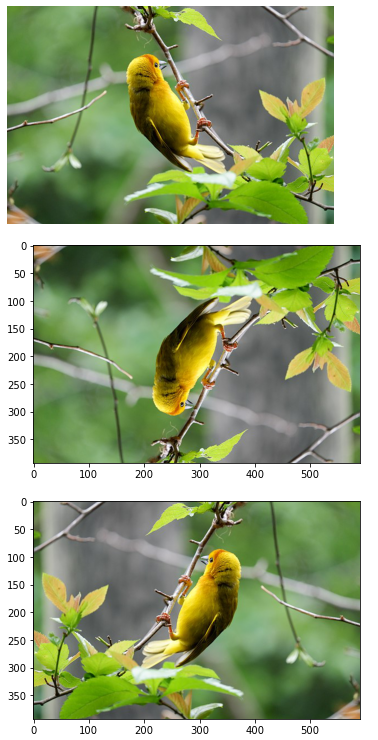
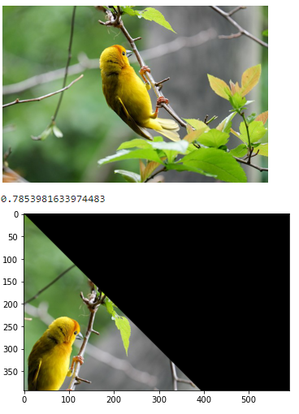
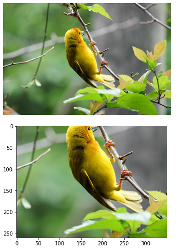

# Image-Transformation
## Aim
To perform image transformation such as Translation, Scaling, Shearing, Reflection, Rotation and Cropping using OpenCV and Python.

## Software Required:
Anaconda - Python 3.7

## Algorithm:
### Step 1:
Import the necessary libraries and read the original image and save it as a image variable.

### Step 2:
Translate the image.

### Step 3:
Scale the image.
### Step 4:
Shear the image.

### Step 5:
Reflection of image.

### Step 6:
Rotate the image.

### Step 7:
Crop the image.

### Step 8:
Display all the Transformed images.

## Program:
```python
Developed By:Manoj Choudhary V
Register Number:212221240025
i)Image Translation
import numpy as np
import cv2
import matplotlib.pyplot as plt
input_image=cv2.imread("2.jpeg") 
input_image=cv2.cvtColor(input_image, cv2.COLOR_BGR2RGB) 
plt.axis("off") 
plt.imshow(input_image)
plt.show()
rows, cols, dim = input_image.shape
M= np.float32([[1, 0, 100],
                [0, 1, 200],
                 [0, 0, 1]])
translated_image =cv2.warpPerspective (input_image, M, (cols, rows))
plt.imshow(translated_image)
plt.show()


ii) Image Scaling
import numpy as np
import cv2
import matplotlib.pyplot as plt
input_image=cv2.imread("2.jpeg") 
cv2.imshow
input_image=cv2.cvtColor(input_image, cv2.COLOR_BGR2RGB) 
plt.axis("off") 
plt.imshow(input_image)
plt.show()
rows, cols, dim = input_image.shape
M = np. float32 ([[1.5, 0 ,0],
                 [0, 1.8, 0],
                  [0, 0, 1]])
scaled_img=cv2.warpPerspective(input_image, M, (cols*2, rows*2))
plt.imshow(scaled_img)
plt.show()


iii)Image shearing
import numpy as np
import cv2
import matplotlib.pyplot as plt
input_image=cv2.imread("2.jpeg") 
cv2.imshow
input_image=cv2.cvtColor(input_image, cv2.COLOR_BGR2RGB) 
plt.axis("off") 
plt.imshow(input_image)
plt.show()
rows, cols, dim = input_image.shape
M_x = np.float32([[1, 0.5, 0],
                  [0, 1 ,0],
                  [0, 0, 1]])

M_y = np.float32([[1, 0, 0],
                  [0.5, 1, 0],
                  [0, 0, 1]])
sheared_img_xaxis = cv2.warpPerspective (input_image, M_x, (int(cols *1.5), int (rows *1.5))) 
sheared_img_yaxis = cv2.warpPerspective (input_image, M_y, (int (cols *1.5), int (rows *1.5)))
plt.imshow(sheared_img_xaxis)
plt.show()
plt.imshow(sheared_img_yaxis)
plt.show()


iv)Image Reflection
import numpy as np
import cv2
import matplotlib.pyplot as plt
input_image=cv2.imread("2.jpeg") 
cv2.imshow
input_image=cv2.cvtColor(input_image, cv2.COLOR_BGR2RGB) 
plt.axis("off") 
plt.imshow(input_image)
plt.show()
row, col, dim = input_image.shape
M_x = np.float32([[1, 0, 0  ],
                  [0,-1 ,row],
                  [0, 0, 1  ]])

M_y = np.float32([[-1, 0, col],
                  [0,1, 0  ],
                  [0, 0, 1   ]])
sheared_img_xaxis = cv2.warpPerspective (input_image, M_x, (int(col), int (row))) 
sheared_img_yaxis = cv2.warpPerspective (input_image, M_y, (int (col), int (row)))
plt.imshow(sheared_img_xaxis)
plt.show()
plt.imshow(sheared_img_yaxis)
plt.show()


v)Image Rotation
import numpy as np
import cv2
import matplotlib.pyplot as plt
input_image=cv2.imread("2.jpeg") 
cv2.imshow
input_image=cv2.cvtColor(input_image, cv2.COLOR_BGR2RGB) 
plt.axis("off") 
plt.imshow(input_image)
plt.show()
angle=np.radians(45)
rows, cols, dim = input_image.shape
M=np.float32([[np.cos(angle),-np.sin(angle),0],[np.sin(angle),np.cos(angle),0],[0,0,1]])
rotated_img= cv2.warpPerspective (input_image, M,(int(cols),int(rows)))
plt.imshow(rotated_img)
plt.show()


vi)Image Cropping
import numpy as np
import cv2
import matplotlib.pyplot as plt
input_image=cv2.imread("2.jpeg") 
cv2.imshow
input_image=cv2.cvtColor(input_image, cv2.COLOR_BGR2RGB) 
plt.axis("off") 
plt.imshow(input_image)
plt.show()
cropped_img=input_image[100:360,100:450]
plt.imshow(cropped_img)
plt.show()
```
## Output:
### i)Image Translation


### ii) Image Scaling


### iii)Image shearing



### iv)Image Reflection



### v)Image Rotation



### vi)Image Cropping



## Result: 

Thus the different image transformations such as Translation, Scaling, Shearing, Reflection, Rotation and Cropping are done using OpenCV and python programming.
